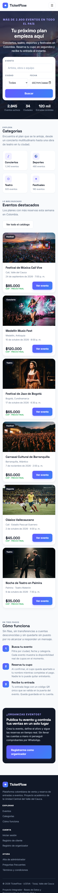
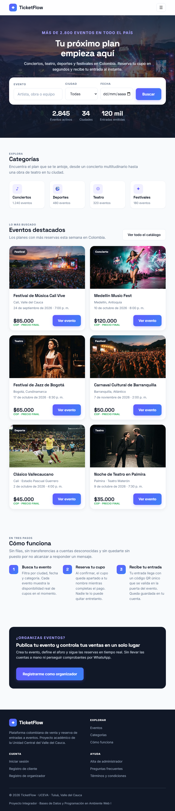
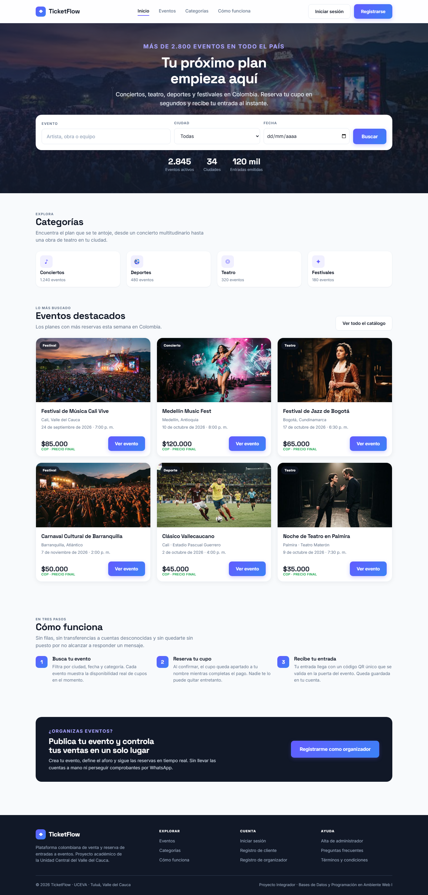

# TicketFlow

Sistema web para la gestión de eventos, espectáculos y reservas. Proyecto Integrador 2026-2 — Bases de Datos y Programación en Ambiente Web I.

## Descripción

TicketFlow es una plataforma web inspirada en referentes de la industria (Tuboleta, Eventbrite, Ticketmaster) que permite:

- Registro e inicio de sesión de usuarios (Cliente, Agente, Administrador).
- Gestión de eventos y espectáculos (creación, edición, control de estado).
- Realización y administración de reservas por evento.
- Dashboard de reportes exclusivo para Administradores.
- Vistas personalizadas por rol de usuario.

## Stack Tecnológico

**Frontend (MVC):**
- HTML5, CSS3, Bootstrap
- JavaScript, TypeScript

**Backend:**
- Node.js + Express + TypeScript

**Base de Datos:**
- PostgreSQL

**Control de versiones:**
- Git + GitHub

## Estructura del repositorio

```
ticketflow/
├── sprint1/          # ENTREGA ACTUAL · Home Page Mobile-First + pantallas de acceso
│   ├── index.html    #   las 5 pantallas en una sola página
│   ├── css/          #   estilos.css: sistema de diseño Mobile-First
│   ├── js/           #   app.js: enrutador + validación de formularios
│   └── img/          #   fotografías de los eventos
├── docs/             # Documentación del proyecto
│   ├── capturas/     #   la Home en celular, tablet y escritorio
│   └── entregables/  #   Matriz de Vester, Canvas y documento del seminario
├── frontend/         # Prototipos anteriores de la interfaz
├── unificado/        # Prototipo navegable con todas las pantallas del diseño
├── design/           # Scripts que generan las pantallas del prototipo
├── maqueta*/         # Exploraciones de diseño (mockups)
├── backend/          # API REST (Node.js + Express + TypeScript) · Sprint 2
└── database/         # Esquema PostgreSQL · Sprint 2
```

Para ver la entrega actual basta con abrir `sprint1/index.html` en el navegador.

## Requisitos previos

- Node.js 18 o superior
- PostgreSQL 14 o superior
- Git

## Instalación (a completar cuando exista código)

```bash
# Clonar el repositorio
git clone https://github.com/eder114/ticketflow.git
cd ticketflow

# Backend
cd backend
npm install
cp .env.example .env   # configurar variables de entorno
npm run dev

# Frontend
cd ../frontend
npm install
npm run dev
```

## Roles del sistema

| Rol | Acciones principales |
|---|---|
| **Cliente** | Visualizar eventos disponibles, realizar reservas, consultar historial |
| **Agente** | Registrar eventos, visualizar eventos, administrar reservas |
| **Administrador** | Consultar reportes y métricas globales del sistema |

## Equipo de desarrollo

| Nombre | Trabajo en el Sprint 1 (Jira SDGE) |
|---|---|
| Eder Fabián Rodríguez Murillo · [@eder114](https://github.com/eder114) | Página de inicio, encabezado, hero con buscador, repositorio |
| Eduardo José Benítez Guevara | Inicio de sesión, registros de cliente y agente, Scrum Daily |
| Jorge Andrés Marín Díaz | Sistema de diseño, responsive, **maquetación Mobile-First** |
| Samuel Uribe Naranjo | Registro de administrador, eventos y categorías, validación |

## Estado del proyecto

Sprint 1 en curso (9 – 28 de septiembre de 2026): interfaz de la página de
inicio y de las pantallas de acceso. El backend y la base de datos entran en
el Sprint 2.

## Licencia

Uso académico — Proyecto Integrador 2026-2.

---

## Sprint 1 · 9 – 28 de septiembre de 2026

**Objetivo del sprint:** construir la página de inicio y crear las interfaces de
registro de cliente, agente y administrador.

La entrega está en [`sprint1/`](sprint1/). Es una **aplicación de una sola
página**: las cinco pantallas viven en `index.html` y un enrutador en
`js/app.js` muestra una a la vez según el fragmento de la URL, sin recargar.

```
sprint1/
├── index.html        Las 5 pantallas
├── css/estilos.css   Sistema de diseño Mobile-First
├── js/app.js         Enrutador + validación de formularios
└── img/              Imágenes de los eventos
```

Para verlo basta con abrir `sprint1/index.html` en el navegador.

### Pantallas y rutas

| Ruta | Pantalla | Historia |
|------|----------|----------|
| `#/inicio` | Página de inicio | SDGE-2, SDGE-3, SDGE-4, SDGE-11 |
| `#/iniciar-sesion` | Inicio de sesión | SDGE-1 |
| `#/registro-cliente` | Registro de cliente | SDGE-7 |
| `#/registro-agente` | Registro de organizador | SDGE-9 |
| `#/registro-admin` | Alta de administrador | SDGE-6 |

La hoja de estilos corresponde a SDGE-12, la validación a SDGE-8, la
maquetación Mobile-First a SDGE-14 y el ajuste de los registros a SDGE-10.

### Maquetación Mobile-First (SDGE-14)

La hoja de estilos está escrita **primero para celular**. Los estilos base de
cada bloque son los de una pantalla de 360 px, y tablet y escritorio se
agregan encima solo con `@media (min-width: …)`. No hay ninguna regla de
layout con `max-width`.

| Punto de corte | Qué cambia |
|---|---|
| Base (360 px) | Menú desplegable, buscador compacto, eventos en 1 columna, categorías de a 2 |
| `min-width: 576px` | Eventos y formularios en 2 columnas, pie en 2 columnas |
| `min-width: 768px` | Buscador en una sola fila, categorías y pasos en fila, márgenes de 40 px |
| `min-width: 1024px` | Barra de navegación completa, eventos en 3 columnas, pie en 4 columnas |
| 1280 px | Ancho máximo del contenido |

Verificado sin desplazamiento horizontal a 360, 768, 1024 y 1440 px, y con
el validador del W3C: **0 errores** en HTML y en CSS.

| Celular | Tablet | Escritorio |
|---|---|---|
|  |  |  |

### Sistema de diseño

| | |
|---|---|
| Colores | Índigo `#635BFF` · Azul `#3B82F6` · Navy `#111827` · Fondo `#F8FAFC` |
| Tipografías | Space Grotesk en títulos · Inter en interfaz |
| Puntos de corte | 576 · 768 · 1024 px, siempre con `min-width` · unidad base de 8 px |
| Márgenes | 16 px en móvil · 40 px en escritorio · contenido máx. 1280 px |
| Radios | Tarjetas 16–20 px · botones 10 px |
| Estados | Ámbar reservada · verde confirmada · rojo cancelada |

### Alcance

Las pantallas son la interfaz. Los formularios validan en el navegador pero
todavía no guardan nada, y el buscador no filtra: ambas cosas dependen del
esquema de PostgreSQL, que entra en el Sprint 2.

### Nota sobre el registro de administrador

Esa pantalla no existía en el diseño de Figma; se diseñó durante este sprint.
A diferencia del cliente (que se autogestiona) y del agente (que solicita y
espera aprobación), el administrador **no puede crearse solo**: requiere código
de invitación y correo institucional `@uceva.edu.co`.
