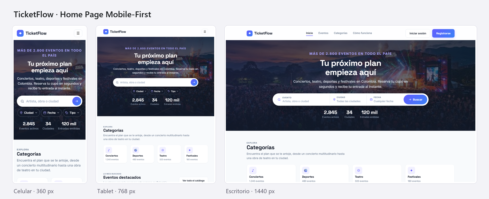

# TicketFlow

Sistema web para la gestión de eventos, espectáculos y reservas. Proyecto Integrador 2026-2 — Bases de Datos y Programación en Ambiente Web I.

## Ver la página

**En línea:** https://eder114.github.io/ticketflow/

Se abre desde el celular, la tablet o el computador. También con este código QR:


**Sin internet:** abrir `frontend/index.html` con doble clic.



## Descripción

TicketFlow es una plataforma web inspirada en referentes de la industria (Tuboleta, Eventbrite, Ticketmaster) que permite:

- Registro e inicio de sesión de usuarios (Cliente, Agente, Administrador).
- Gestión de eventos y espectáculos (creación, edición, control de estado).
- Realización y administración de reservas por evento.
- Dashboard de reportes exclusivo para Administradores.
- Vistas personalizadas por rol de usuario.

## Estructura del repositorio

```
ticketflow/
├── frontend/                    Aplicación web (patrón MVC)
│   ├── index.html               Las pantallas de la aplicación
│   ├── assets/
│   │   ├── css/estilos.css      Estilos Mobile-First
│   │   └── img/                 Fotografías de los eventos
│   └── js/
│       ├── modelos/             Datos y reglas (rutas, validación, calendario)
│       ├── vistas/              Todo lo que cambia la pantalla
│       ├── controladores/       Eventos del usuario: unen modelos y vistas
│       └── app.js               Arranque de la aplicación
├── backend/                     API REST · Sprint 2
├── database/                    Esquema PostgreSQL · Sprint 2
└── index.html                   Entrada de GitHub Pages: abre el frontend
```

### Patrón MVC en el frontend

| Capa | Archivos | Qué hace |
|---|---|---|
| **Modelo** | `rutas.js`, `validacion.js`, `calendario.js` | Guarda las reglas y los datos. No toca la página. |
| **Vista** | `pantallas.js`, `formularios.js`, `buscador.js`, `menu.js` | Muestra y esconde pantallas, pinta errores, paneles y el calendario. |
| **Controlador** | `enrutador.js`, `formularios.js`, `buscador.js`, `menu.js` | Escucha clics y cambios, le pide los datos al modelo y le dice a la vista qué mostrar. |

Ejemplo: al salir de un campo, el **controlador** de formularios le pregunta al
**modelo** de validación si el valor cumple las reglas, y le pide a la **vista**
que muestre o borre el error.

## Pantallas y rutas

| Ruta | Pantalla |
|------|----------|
| `#/inicio` | Página de inicio |
| `#/iniciar-sesion` | Inicio de sesión |
| `#/registro-cliente` | Registro de cliente |
| `#/registro-agente` | Registro de organizador |
| `#/registro-admin` | Alta de administrador |

## Maquetación Mobile-First

Los estilos base son los del celular (360 px), y tablet y escritorio se agregan
encima solo con `@media (min-width: …)`.

| Punto de corte | Qué cambia |
|---|---|
| Base (360 px) | Menú desplegable, buscador en píldora con chips de ciudad, fecha y tipo, eventos en 1 columna, categorías de a 2 |
| `min-width: 576px` | Eventos y formularios en 2 columnas, pie en 2 columnas |
| `min-width: 768px` | Categorías y pasos en fila, márgenes de 40 px |
| `min-width: 1024px` | Barra de navegación completa, buscador en una sola barra, eventos en 3 columnas, pie en 4 columnas |
| 1280 px | Ancho máximo del contenido |

Validador del W3C: **0 errores** en HTML y en CSS.

## Stack tecnológico

| Parte | Tecnología |
|---|---|
| Frontend | HTML5, CSS3, JavaScript (MVC) |
| Backend | Node.js + Express + TypeScript |
| Base de datos | PostgreSQL |
| Control de versiones | Git + GitHub |

## Roles del sistema

| Rol | Acciones principales |
|---|---|
| **Cliente** | Visualizar eventos disponibles, realizar reservas, consultar historial |
| **Agente** | Registrar eventos, visualizar eventos, administrar reservas |
| **Administrador** | Consultar reportes y métricas globales del sistema |

## Equipo de desarrollo

| Nombre | Trabajo en el Sprint 1 (Jira SDGE) |
|---|---|
| Eder Fabián Rodríguez Murillo · [@eder114](https://github.com/eder114) | Página de inicio, encabezado, hero con buscador, repositorio |
| Eduardo José Benítez Guevara | Inicio de sesión, registros de cliente y agente, Scrum Daily |
| Jorge Andrés Marín Díaz | Sistema de diseño, responsive, maquetación Mobile-First |
| Samuel Uribe Naranjo | Registro de administrador, eventos y categorías, validación |

## Estado del proyecto

Sprint 1 (9 – 28 de septiembre de 2026): interfaz de la página de inicio y de
las pantallas de acceso. Los formularios validan en el navegador pero todavía
no guardan nada; el backend y la base de datos entran en el Sprint 2.

## Licencia

Uso académico — Proyecto Integrador 2026-2.
