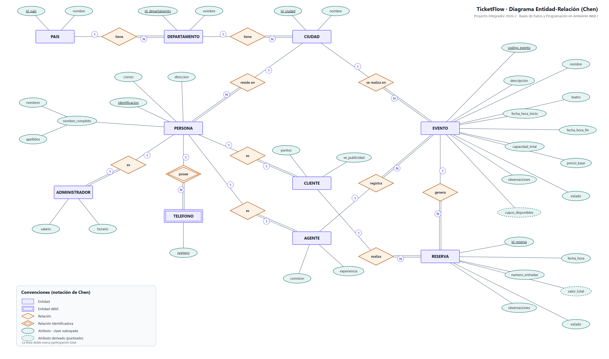

# Base de datos

Esquema en PostgreSQL · Sprint 2.

## Diagrama Entidad-Relación (notación de Chen)

| Archivo | Para qué sirve |
|---|---|
| `DER_Chen_TicketFlow.png` | Imagen para el documento de entrega |
| `DER_Chen_TicketFlow.svg` | Imagen vectorial, no se pixela al ampliar |
| `DER_Chen_TicketFlow.drawio` | Editable en [draw.io](https://app.diagrams.net) |
| `der_chen.py` | Genera los tres archivos anteriores |
| `Modelo_Relacional_TicketFlow.docx` | Paso del modelo E-R al modelo relacional, siguiendo los pasos de la asignatura |
| `modelo_relacional.py` | Genera el documento anterior |

Notación: rectángulo = entidad · rectángulo doble = entidad débil · rombo =
relación · rombo doble = relación identificadora · elipse = atributo ·
elipse punteada = atributo derivado · subrayado = clave primaria ·
subrayado punteado = clave parcial · línea doble = participación total.

## Entidades y atributos

| Entidad | Clave primaria | Atributos |
|---|---|---|
| `PAIS` | id_pais | nombre |
| `DEPARTAMENTO` | id_departamento | nombre |
| `CIUDAD` | id_ciudad | nombre |
| `PERSONA` | identificacion (cédula o pasaporte) | nombre_completo (compuesto: nombres, apellidos), correo, direccion |
| `TELEFONO` **(débil)** | numero (clave parcial) | — |
| `CLIENTE` | identificacion (heredada) | puntos, ve_publicidad |
| `AGENTE` | identificacion (heredada) | comision, experiencia |
| `ADMINISTRADOR` | identificacion (heredada) | salario, horario |
| `EVENTO` | codigo_evento | nombre, descripcion, teatro, fecha_hora_inicio, fecha_hora_fin, capacidad_total, precio_base, observaciones, estado, cupos_disponibles *(derivado)* |
| `RESERVA` | id_reserva | fecha_hora, numero_entradas, valor_total *(derivado)*, observaciones, estado |

**Atributo compuesto:** `nombre_completo` se divide en nombres y apellidos.

**Atributos derivados:** `cupos_disponibles` = capacidad_total − entradas de las
reservas confirmadas. `valor_total` = numero_entradas × precio_base del evento.
No se guardan: se calculan.

**Entidad débil:** `TELEFONO` no existe sin su persona y su número solo
identifica dentro de esa persona, por eso se relaciona con `PERSONA` mediante
una relación identificadora.

## Relaciones y cardinalidad

| Relación | Entidades | Cardinalidad | Por qué |
|---|---|---|---|
| `tiene` | PAIS – DEPARTAMENTO | 1:N | Un país tiene varios departamentos; cada departamento pertenece a un solo país. |
| `tiene` | DEPARTAMENTO – CIUDAD | 1:N | Un departamento tiene varias ciudades; cada ciudad pertenece a uno solo. |
| `reside en` | CIUDAD – PERSONA | 1:N | Cada persona registra una sola ciudad; en una ciudad viven muchas personas. |
| `posee` | PERSONA – TELEFONO | 1:N | Una persona puede tener varios teléfonos; cada teléfono es de una sola persona. |
| `es` | PERSONA – CLIENTE | 1:1 | Cliente es una especialización de persona: cada cliente es una persona y no se repite. |
| `es` | PERSONA – AGENTE | 1:1 | Igual que el anterior. |
| `es` | PERSONA – ADMINISTRADOR | 1:1 | Igual que el anterior. |
| `se realiza en` | CIUDAD – EVENTO | 1:N | Cada evento ocurre en una ciudad; en una ciudad hay muchos eventos. |
| `registra` | AGENTE – EVENTO | 1:N | El agente registra eventos; cada evento tiene un responsable. |
| `realiza` | CLIENTE – RESERVA | 1:N | Un cliente hace muchas reservas; cada reserva es de un solo cliente. |
| `genera` | EVENTO – RESERVA | 1:N | Un evento recibe muchas reservas; cada reserva es de un solo evento. |

`RESERVA` resuelve la relación N:M que habría entre `CLIENTE` y `EVENTO`: al
guardar fecha, número de entradas, valor y estado, deja de ser una simple tabla
de cruce y se convierte en una entidad propia.

## Paso al modelo relacional

El documento `Modelo_Relacional_TicketFlow.docx` aplica los siete pasos vistos
en clase (entidades fuertes, entidad débil, 1:N, 1:1 y subtipos, N:M,
atributos multivaluados y relaciones n-arias), y termina con el esquema de las
diez tablas, sus llaves foráneas, las restricciones de integridad y el
`CREATE TABLE` para PostgreSQL.

## Estados

- **Evento:** Programado, En Boletería, En Vivo, Finalizado, Cancelado
- **Reserva:** Reservada, Confirmada, Cancelada
